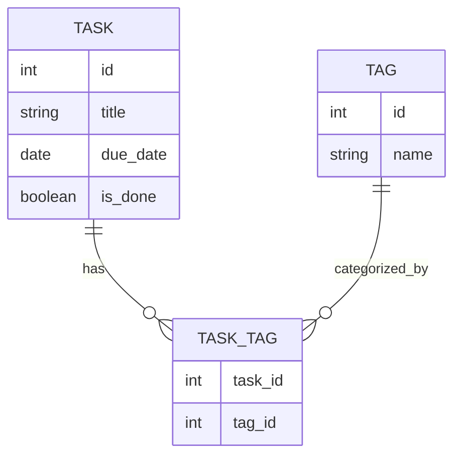

```mermaid

erDiagram
    TASK {
      int id
      string title
      date due_date
      boolean is_done
    }

    TAG {
      int id
      string name
    }

    TASK_TAG {
      int task_id
      int tag_id
    }

    TASK ||--o{ TASK_TAG : has
    TAG  ||--o{ TASK_TAG : categorized_by
```
